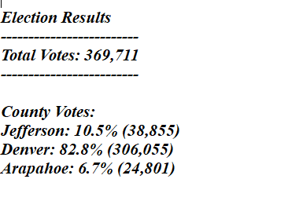
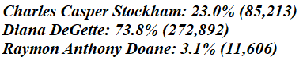
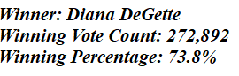

# Election_Analysis
## Overview of Election Audit
The purpose of this election audit is to automate the output of the additional data as required by the clients Seth and Tom. After the succes of the initial election audit project there were some additional data required by the clients to complete the audit.They are:
* The Voter turn out for each county
* The percentage of votes from each county out of the total count
* The county with the highest turnout

## Election-Audit Results

* 369711 votes were cast in this congressional election
* breakdown of the number of votes and the percentage of total votes for each county in the precinct is as follows

  

* Which county had the largest number of votes : 
 Denver

* Breakdown of the number of votes and the percentage of the total votes each candidate received.
  
     

* Candidate who won the election, their vote count, and their percentage of the total votes
 
  
     
     
## Election Audit Summary
The Same project can be extended to presidential.
For Presidential elections the county dictionary can be changed to Provincial dictionary. This can be further automated by giving in an input for the user to choose whether he/she is voting for presidential election or local election with the help of an if else iteration.
